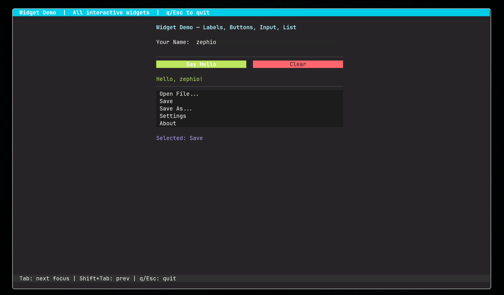

# Zephio

A lightweight, portable terminal UI framework in C with **zero external dependencies**

## Features

- Raw terminal mode with alternate screen buffer
- Double-buffered, diff-based rendering (flicker-free)
- Full keyboard input parsing (special keys, modifiers, escape sequences)
- Mouse event support (click, drag, scroll, hover)
- Widget tree with parent-child hierarchy
- Focus management (Tab / Shift+Tab cycling)
- Built-in widgets: Label, Button, InputField, List, Container, Box, Separator, CheckBox, Radio, Progress, Dropdown, Dialog, MenuBar, ContextMenu, TabBar, StatusBar, Table, TreeView, TextArea, TextView, ScrollContainer
- Layout engine (vertical/horizontal stacks, weighted sizing)
- Style system with themes (256-color + truecolor RGB)
- Animation system (easing, slide/fade effects)
- Mouse support (click, drag, scroll, hover)
- Clipboard support (OSC 52)
- Automatic resize handling
- Signal-safe cleanup on exit/crash
- AddressSanitizer and UBSan support via `DEBUG=1`

## Images


## Build

Requires `gcc` and `make`.

```sh
make              # Release build (lib/libzephio.a + examples)
make DEBUG=1      # Debug build with -g -O0 -fsanitize=address,undefined
make examples     # Build examples only
make clean        # Remove build/ and lib/
```

Output:
- `lib/libzephio.a` — static library
- `build/*` — compiled example binaries

## Quick Start

### Minimal example (low-level API)

```c
#include "tui.h"
#include "zephio_ansi.h"

int main(void) {
    tui_init();

    TuiSize size;
    tui_get_size(&size);

    ansi_set_fg(2);
    ansi_write_at(size.rows / 2, (size.cols - 12) / 2,
                  "Hello, TUI!", 12);
    ansi_reset();

    getchar();      /* wait for any key */
    tui_shutdown();
    return 0;
}
```

### App-based example (high-level API)

```c
#include "tui.h"
#include "zephio_app.h"
#include "zephio_label.h"
#include "zephio_button.h"
#include "zephio_widget.h"

typedef struct {
    TuiWidget root;
    TuiLabel  msg;
    TuiButton btn;
} App;

static int on_init(TuiApp *app, void *ud) {
    App *a = (App *)ud;
    TuiSize sz = tui_screen_size();
    tui_widget_init(&a->root, 0, 0, sz.cols, sz.rows, NULL, NULL);
    tui_label_init(&a->msg, 2, 2, 30, 1, "Press the button below");
    tui_button_init(&a->btn, 2, 4, 12, 1, "Click Me");
    a->btn.base.focusable = 1;
    tui_widget_add_child(&a->root, &a->msg.base);
    tui_widget_add_child(&a->root, &a->btn.base);
    return 0;
}

static int on_render(TuiApp *app, void *ud) {
    App *a = (App *)ud;
    tui_screen_clear();
    tui_widget_render(&a->root);
    tui_screen_render();
    return 0;
}

static int on_input(TuiApp *app, const TuiEvent *ev, void *ud) {
    if (ev->key == TUI_KEY_ESCAPE) return 1;
    TuiWidget *f = tui_widget_get_focused(&((App*)ud)->root);
    if (f) tui_widget_handle_input(f, ev);
    return 0;
}

int main(void) {
    App app = {0};
    TuiAppConfig cfg = {
        .on_init   = on_init,
        .on_render = on_render,
        .on_input  = on_input,
        .user_data = &app,
        .tick_rate_ms = 50
    };
    TuiApp *a = tui_app_new(&cfg);
    tui_app_run(a);
    tui_app_free(a);
    return 0;
}
```

## Project Structure

```
├── include/          Public headers (API, 36 files)
│   ├── tui.h              Core init/shutdown
│   ├── tui_app.h          High-level app runtime (event loop, lifecycle)
│   ├── tui_widget.h       Base widget type and tree operations
│   ├── tui_screen.h       Double-buffered screen
│   ├── tui_input.h        Keyboard input and event loop
│   ├── tui_mouse.h        Mouse event types
│   ├── tui_ansi.h         ANSI escape sequence helpers
│   ├── tui_style.h        Themes and styles
│   ├── tui_layout.h       Layout engine
│   ├── tui_animation.h    Animation system
│   ├── tui_label.h        tui_button.h   tui_input_field.h  tui_list.h
│   ├── tui_container.h    tui_box.h      tui_separator.h    tui_text.h
│   ├── tui_checkbox.h     tui_radio.h    tui_progress.h
│   ├── tui_dropdown.h     tui_dialog.h   tui_clipboard.h
│   ├── tui_menubar.h      tui_context_menu.h
│   ├── tui_tabbar.h       tui_statusbar.h
│   ├── tui_table.h        tui_tree_view.h
│   ├── tui_textarea.h     tui_text_view.h  tui_scroll_container.h
│   └── tui_terminal.h
├── src/              Implementation
├── examples/         Ready-to-run demos (15 examples)
├── tests/            Unit tests
├── docs/             Doxygen API reference, architecture docs, tutorials
├── Makefile
└── roadmap.md
```

## Widget Overview

| Widget | Header | Description |
|---|---|---|
| **Label** | `tui_label.h` | Static text display with configurable colors and attributes |
| **Button** | `tui_button.h` | Clickable button with `on_click` callback |
| **InputField** | `tui_input_field.h` | Text input with `on_change` / `on_submit` callbacks |
| **List** | `tui_list.h` | Scrollable selectable list with `on_select` callback |
| **Container** | `tui_container.h` | Background panel with configurable background color |
| **Box** | `tui_box.h` | Bordered box with optional title |
| **Separator** | `tui_separator.h` | Horizontal or vertical divider line |
| **CheckBox** | `tui_checkbox.h` | Toggle checkbox with label |
| **Radio** | `tui_radio.h` | Single-selection radio button group |
| **Progress** | `tui_progress.h` | Horizontal progress bar (0-100%) |
| **Dropdown** | `tui_dropdown.h` | Expandable selection dropdown |
| **Dialog** | `tui_dialog.h` | Modal dialog with overlay |
| **MenuBar** | `tui_menubar.h` | Horizontal menu bar with submenus |
| **ContextMenu** | `tui_context_menu.h` | Right-click context menu |
| **TabBar** | `tui_tabbar.h` | Tab-based page switching |
| **StatusBar** | `tui_statusbar.h` | Segmented status bar |
| **Table** | `tui_table.h` | Column-based data display with headers |
| **TreeView** | `tui_tree_view.h` | Hierarchical tree with expand/collapse |
| **TextArea** | `tui_textarea.h` | Multi-line editable text |
| **TextView** | `tui_text_view.h` | Multi-line read-only text with word wrap |
| **ScrollContainer** | `tui_scroll_container.h` | Scrollable widget container |
| **Clipboard** | `tui_clipboard.h` | OSC 52 clipboard copy/paste |

All widgets embed `TuiWidget` as their first member and support the widget tree operations from `tui_widget.h` (add/remove children, render, focus, hit-testing, mouse dispatch).

## Documentation

- [Getting Started](docs/GETTING_STARTED.md) — Build, first project, troubleshooting
- [Architecture](docs/ARCHITECTURE.md) — Module map, rendering pipeline, event flow
- [Widget Development](docs/WIDGET_DEVELOPMENT.md) — Creating custom widgets
- [Layout System](docs/LAYOUT.md) — Fixed/Fill/Auto, weights, nested layouts
- [Styling & Theming](docs/STYLING.md) — Colors, themes, truecolor fallback
- [ncurses Migration](docs/MIGRATION_NCURSES.md) — Cheatsheet: ncurses → Zephio mapping

## License

MIT License - see [LICENSE](LICENSE) for details.
